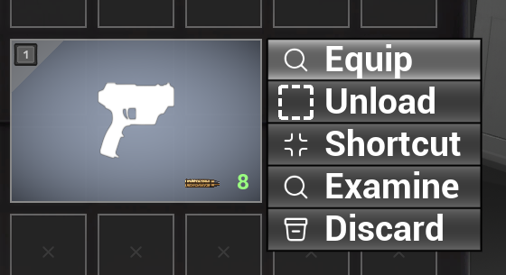

# Actions

## Create Action

You can add any number of additional actions to the item's context menu.

To do this, right-click in the Content Browser and create an Action blueprint.

In the opened menu, you need to choose a name for the action and its icon.

Now you need to override two functions. One is responsible for whether the option will be displayed in the context menu,
and the other for the action that will occur after it's clicked.

## Can Execute Function

If the returned value is true, then this action will be displayed in the context menu.

you cannot use functions that require a reference to the world. In other words, the function "Get Player Pawn" will not
work here, as the object is not created for optimization purposes and does not exist in the world.

But references to the character, inventory, and item are passed into this function, so you don't need that. For
instance, this way you can obtain a reference to any component within the character:

## On Execute Function

Here, you can write any logic that will be executed when the action in the context menu is clicked.

## Associate Action With The Item

Open the blueprint of your item and add the class of your action to the "Actions" array.

Congratulations. Now all your actions are displayed in the context menu of the item.

## Examples

In this example, the "Unload" action is displayed in the context menu only if there are bullets in the item.

And upon execution, the action adds the number of bullets that can fit in the inventory and subtracts the same amount
from the item.

Here, the reload action is displayed only if the weapon has space for bullets.

