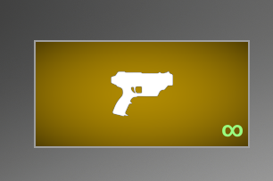

# Tags

## Add tags

In the item blueprint, you can add any number of tags.


## Use Tags

You can check if the item has the required tag using these two functions: "Has Tag" and "Get Tags".


## Special tags

There are several special tags that you can use, and this will affect certain settings. The number of these tags may
expand with updates.

```UnlimitedAmmo``` - Replace the ammo count in the weapon's shortcut with an infinity symbol.



```HideAmmo``` - Hide the ammo count icon in the shortcut.


